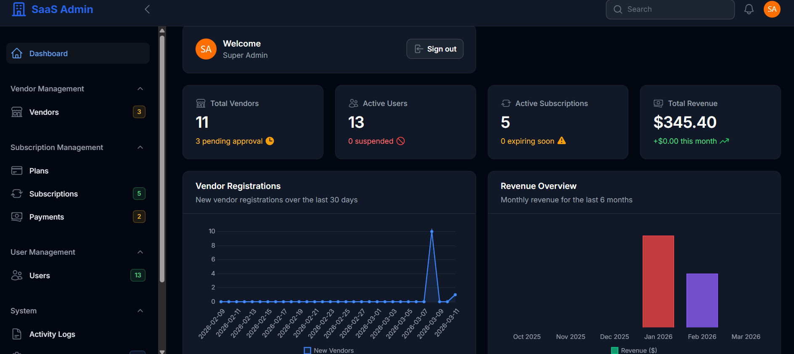
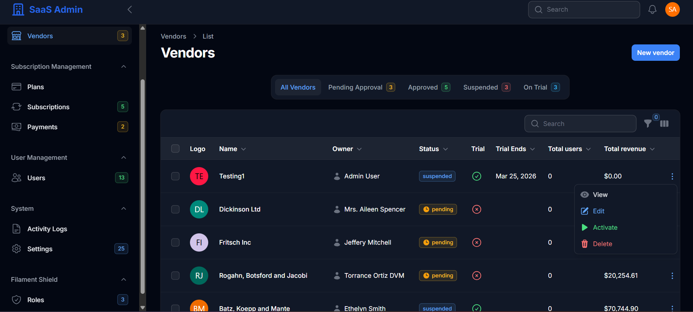

# Multi-Vendor SaaS Admin Panel

A comprehensive Multi-Vendor SaaS platform built with **Laravel 11** and **Filament v3**. This admin panel provides complete management capabilities for vendors, subscription plans, users, payments, and system settings.

## Screenshots

### Dashboard
 
 

## Features

### Admin Panel Features
- **Dashboard** with statistics and charts
- **Vendor Management** (CRUD, approval workflow, suspension)
- **Plan Management** (subscription plans with limits and features)
- **Subscription Management** (active subscriptions, trials, renewals)
- **User Management** (with roles and permissions)
- **Payment Management** (tracking, refunds, reporting)
- **Activity Logs** (audit trail for all actions)
- **System Settings** (configurable via database)

### Technical Features
- **Role-Based Access Control** (RBAC) with Spatie Permission
- **Multi-tenancy ready** architecture
- **Stripe Integration** ready for payments
- **Activity Logging** for audit trails
- **Database Notifications**
- **Responsive Design** with Filament v3
- **API Ready** with Laravel Sanctum

## Requirements

- PHP 8.2+
- MySQL 8.0+ or MariaDB 10.6+
- Composer 2.0+
- Node.js 18+ (for asset building)

## Installation

### 1. Clone the Repository

```bash
cd saas-admin-panel
```

### 2. Install Dependencies

```bash
composer install
npm install
```

### 3. Environment Configuration

```bash
cp .env.example .env
php artisan key:generate
```

Edit `.env` file with your database credentials:

```env
DB_CONNECTION=mysql
DB_HOST=127.0.0.1
DB_PORT=3306
DB_DATABASE=saas_admin_panel
DB_USERNAME=root
DB_PASSWORD=your_password
```

### 4. Database Setup

```bash
php artisan migrate
php artisan db:seed
```

### 5. Create Storage Link

```bash
php artisan storage:link
```

### 6. Build Assets

```bash
npm run build
```

### 7. Start the Development Server

```bash
php artisan serve
```

Access the admin panel at: `http://localhost:8000/admin`

## Default Login Credentials

| Role | Email | Password |
|------|-------|----------|
| Super Admin | `admin@saas.com` | `password` |
| Admin | `admin2@saas.com` | `password` |

## Project Structure

```
saas-admin-panel/
├── app/
│   ├── Filament/
│   │   ├── Resources/          # Filament CRUD resources
│   │   │   ├── VendorResource.php
│   │   │   ├── PlanResource.php
│   │   │   ├── SubscriptionResource.php
│   │   │   ├── UserResource.php
│   │   │   ├── PaymentResource.php
│   │   │   └── ActivityLogResource.php
│   │   ├── Pages/              # Custom Filament pages
│   │   └── Widgets/            # Dashboard widgets
│   ├── Models/                 # Eloquent models
│   │   ├── User.php
│   │   ├── Vendor.php
│   │   ├── Plan.php
│   │   ├── Subscription.php
│   │   ├── Payment.php
│   │   └── ...
│   ├── Policies/               # Authorization policies
│   └── Providers/              # Service providers
├── database/
│   ├── migrations/             # Database migrations
│   ├── seeders/                # Database seeders
│   └── factories/              # Model factories
├── config/                     # Configuration files
├── routes/                     # Route definitions
├── resources/                  # Views and assets
└── ...
```

## Database Schema

### Core Tables

| Table | Description |
|-------|-------------|
| `users` | System users with authentication |
| `vendors` | Vendor/tenant information |
| `plans` | Subscription plans with features |
| `subscriptions` | Active and historical subscriptions |
| `payments` | Payment transactions |
| `vendor_users` | Vendor membership relationships |
| `activity_logs` | Audit trail |
| `settings` | System configuration |

### Relationships

```
User
├── hasMany: Vendor (owned)
├── belongsToMany: Vendor (member)
├── hasMany: Subscription
└── hasMany: Payment

Vendor
├── belongsTo: User (owner)
├── hasMany: Subscription
├── hasMany: Payment
└── hasMany: VendorUser

Plan
├── hasMany: Subscription
└── hasMany: Payment

Subscription
├── belongsTo: Vendor
├── belongsTo: Plan
└── hasMany: Payment
```

## Filament Resources

### VendorResource
- Full CRUD operations
- Approval workflow (approve/reject/suspend)
- Logo and favicon upload
- Custom domain support
- Statistics tracking

### PlanResource
- Plan creation with limits
- Feature toggles
- Stripe integration fields
- Trial configuration
- Duplicate plans

### SubscriptionResource
- Subscription management
- Cancel/resume subscriptions
- Trial handling
- Period management

### UserResource
- User management
- Role assignment
- Email verification
- Status management

### PaymentResource
- Payment tracking
- Refund processing
- Status management
- Billing information

## Roles & Permissions

### Default Roles

| Role | Description |
|------|-------------|
| `super_admin` | Full system access |
| `admin` | Most administrative functions |
| `user` | Regular user access |

### Key Permissions

- `vendors.view`, `vendors.create`, `vendors.edit`, `vendors.delete`
- `plans.view`, `plans.create`, `plans.edit`, `plans.delete`
- `subscriptions.view`, `subscriptions.create`, `subscriptions.edit`
- `payments.view`, `payments.create`, `payments.refund`
- `users.view`, `users.create`, `users.edit`, `users.delete`
- `settings.view`, `settings.edit`

## Configuration

### Environment Variables

```env
# Stripe Configuration
STRIPE_KEY=pk_test_...
STRIPE_SECRET=sk_test_...
STRIPE_WEBHOOK_SECRET=whsec_...

# SaaS Configuration
SAAS_TRIAL_DAYS=14
SAAS_DEFAULT_PLAN=free
SAAS_CURRENCY=usd

# Super Admin Credentials
SUPER_ADMIN_EMAIL=admin@saas.com
SUPER_ADMIN_PASSWORD=password
```

### Settings API

```php
// Get a setting
$value = Setting::get('site_name', 'Default Value');

// Set a setting
Setting::set('site_name', 'My SaaS Platform', 'general');

// Get all settings in a group
$generalSettings = Setting::getGroup('general');
```

## API Endpoints

The application is API-ready with Laravel Sanctum. API routes can be defined in `routes/api.php`.

## Useful Commands

```bash
# Clear all caches
php artisan optimize:clear

# Create a new admin user
php artisan make:filament-user

# Run database seeders
php artisan db:seed

# Create storage link
php artisan storage:link

# Queue worker (for background jobs)
php artisan queue:work

# Schedule runner (for cron jobs)
php artisan schedule:run
```

## Testing

```bash
# Run PHPUnit tests
php artisan test

# Run with coverage
php artisan test --coverage
```

## Security

- All passwords are hashed using Bcrypt
- CSRF protection enabled
- SQL injection protection via Eloquent
- XSS protection via Blade escaping
- Role-based access control implemented

## Customization

### Adding a New Resource

1. Create model: `php artisan make:model ModelName -mf`
2. Create migration and run `php artisan migrate`
3. Create policy: `php artisan make:policy ModelNamePolicy --model=ModelName`
4. Create Filament resource: `php artisan make:filament-resource ModelName`

### Customizing the Dashboard

Edit widgets in `app/Filament/Widgets/`:
- `StatsOverview.php` - Main statistics cards
- `RecentVendorsChart.php` - Vendor registration chart
- `RevenueChart.php` - Revenue overview chart
- `RecentActivity.php` - Recent activity table

## Troubleshooting

### Common Issues

1. **Permission denied on storage**: 
   ```bash
   chmod -R 775 storage bootstrap/cache
   ```

2. **Class not found errors**:
   ```bash
   composer dump-autoload
   ```

3. **Migration errors**:
   ```bash
   php artisan migrate:fresh --seed
   ```

## License

This project is open-sourced software licensed under the MIT license.

## Support

For support, please open an issue in the repository or contact the development team.

## Credits

- [Laravel](https://laravel.com)
- [Filament](https://filamentphp.com)
- [Spatie Laravel Permission](https://github.com/spatie/laravel-permission)
- [Tailwind CSS](https://tailwindcss.com)
